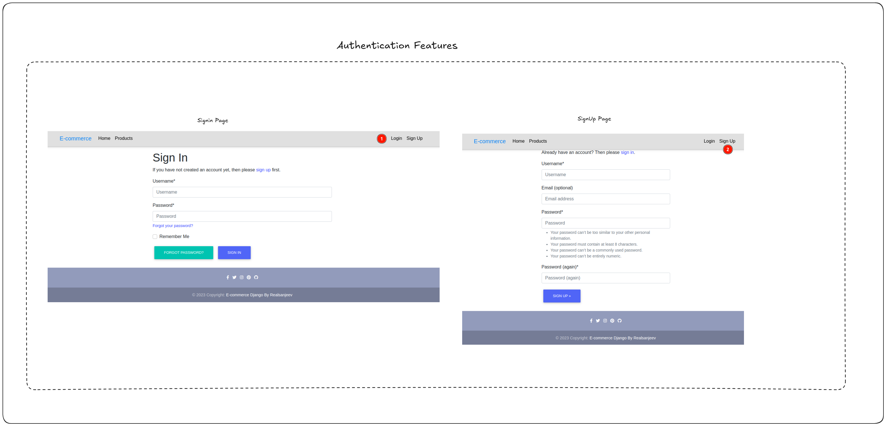
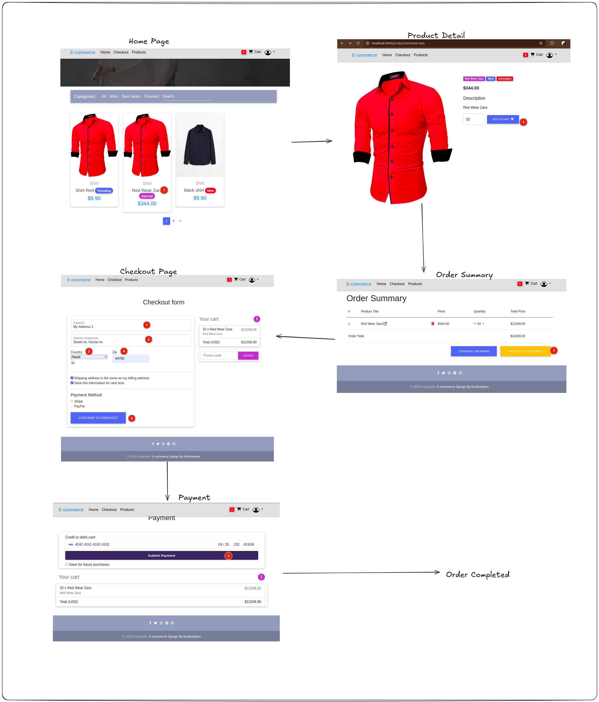
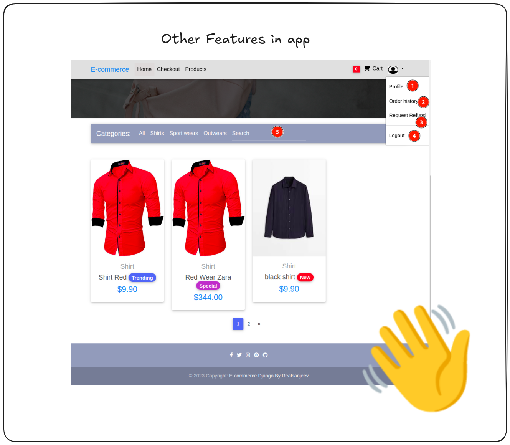

# Django Ecommerce
This Django e-commerce project is a robust web application designed to facilitate online shopping experiences. It offers a user-friendly interface for customers to browse through a wide range of products, add items to their cart, and securely complete their purchases. The platform includes features for product categorization, user authentication, and order management.

## Running the Application

1. **Clone the Repository and Navigate to the Working Directory:**
    ```bash
    git clone https://github.com/realsanjeev/django-ecommerce.git
    cd django-ecommerce
    ```

2. **Create a Virtual Environment and Install Requirements:**
    ```bash
    python -m venv venv
    source venv/bin/activate
    pip install -r requirements.txt
    ```

3. **Run the Application:**
    ```bash
    cd src
    python manage.py makemigrations
    python manage.py migrate
    python manage.py runserver
    ```

**Alternatively, if you have Docker installed, you can use the provided Dockerfile to run the project:**

   1. **Build the Docker Image:**
        ```bash
        docker build -t django-ecommerce .
        ```

   2. **Run the Docker Container:**
        ```bash
        docker run -p 8000:8000 --name django-ecommerce-container django-ecommerce
        ```

This will start the Django e-commerce application, making it accessible at `http://localhost:8000` on your local machine.

You can log in to the app using the superuser credentials: `admin@admin.com` with the password `admin`.

### Formatting Code with `pre-commit`

To run the `pre-commit` hook and format your code, use the following command:
```bash
pre-commit run --all-files
```

To update the hooks to their latest versions, execute:
```bash
pre-commit autoupdate
```

### Key Features:
- User-friendly product catalog with detailed descriptions and images.
- User authentication and account management for personalized shopping experiences.
- Shopping cart functionality for adding, modifying, and removing items.
- Secure checkout process with payment integration.
- Order history and tracking for customers.
- Admin interface for managing products, orders, and user accounts.
- Responsive design for seamless browsing on various devices.

This project serves as an excellent foundation for building a fully functional e-commerce website. It incorporates best practices in Django development to ensure scalability, security, and maintainability. Feel free to explore, modify, and enhance this project to meet specific business requirements and create a thriving online store.

### Demo Image
**Authentication Feature Image**



**Product Ordereing Process**


**Other Features**


## Contributing

Contributions are welcome! If you find any issues or want to add new features, feel free to submit a pull request.

## Contact Me

<table>
  <tr>
    <td></td>
    <td></td>
    <td></td>
    <td></td>
  </tr>
</table>
